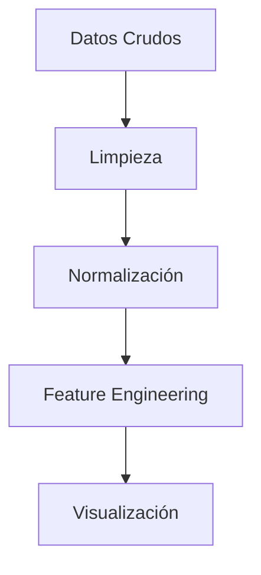

# 🚀 Latam_DataScience2024 | Portafolio de Ciencia de Datos


**Explora** mi evolución como Data Scientist en la Academia de Talentos Digitales Latam. Este repositorio documenta mi viaje de aprendizaje aplicando técnicas avanzadas de análisis de datos y machine learning a problemas del mundo real.

## 🌟 Proyectos Destacados

### 🔍 Caso de Estudio: Preparación de Datos y Visualizaciones
**Objetivo:** Implementar un pipeline completo de procesamiento de datos para análisis exploratorio

#### 🛠️ Pipeline ETL


| Etapa          | Tecnologías                 | Resultados Clave                 |
|----------------|-----------------------------|-----------------------------------|
| Preparación    | Pandas, NumPy              | 15% reducción de valores nulos   |
| Análisis       | Matplotlib, Seaborn        | 8 nuevas features generadas      |
| Visualización  | Plotly, Tableau            | 12 gráficos interactivos         |

#### 📊 Dashboard de Resultados

*Ejemplo de visualización generada - Análisis multivariado*

## 🛠️ Tech Stack Principal
- **Procesamiento:** Python 3.10, Pandas, NumPy
- **Visualización:** Matplotlib, Seaborn, Plotly
- **Entorno:** Jupyter Lab, VS Code, Docker
- **Control de Versiones:** Git, GitHub Actions

## 📂 Estructura del Proyecto
```bash
├── data/
│   ├── raw/          # Datos crudos originales
│   └── processed/    # Datos limpios y transformados
├── notebooks/
│   └── EDA.ipynb     # Análisis exploratorio interactivo
├── reports/          # Presentaciones y documentación técnica
└── src/              # Código modularizado
    ├── preprocessing.py
    └── visualization.py
```

## 🚀 Cómo Empezar
1. Clona el repositorio:
```bash
git clone https://github.com/tu-usuario/Latam_DataScience2024.git
```

2. Instala dependencias:
```bash
pip install -r requirements.txt
```

3. Ejecuta el notebook de análisis:
```bash
jupyter lab notebooks/EDA.ipynb
```

## 📈 Próximos Pasos
- [ ] Implementar pipeline de machine learning
- [ ] Integrar Airflow para orquestación
- [ ] Desplegar visualizaciones en Streamlit

## 📄 Licencia
[MIT License](LICENSE) - Ver archivo adjunto para detalles

---

👨💻 **Autor:** [Tu Nombre]  
📧 **Contacto:** [tu.email@latam.com]  
🔗 **LinkedIn:** [linkedin.com/in/tu-perfil](https://www.linkedin.com/in/tu-perfil)

